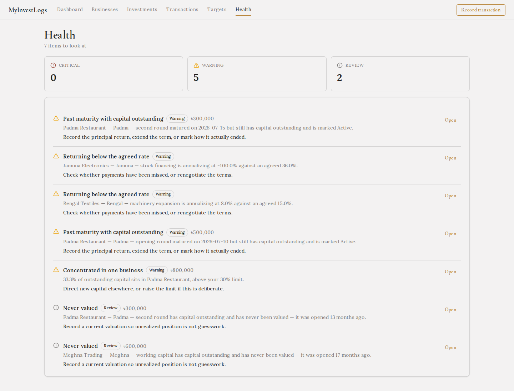
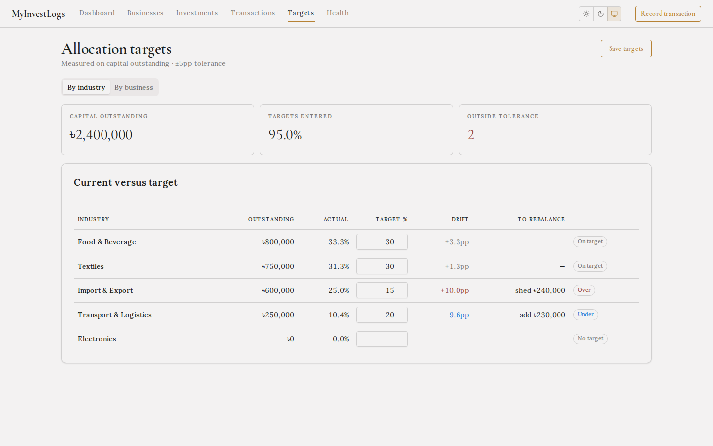
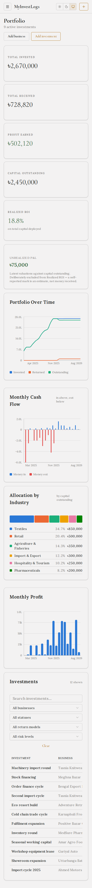
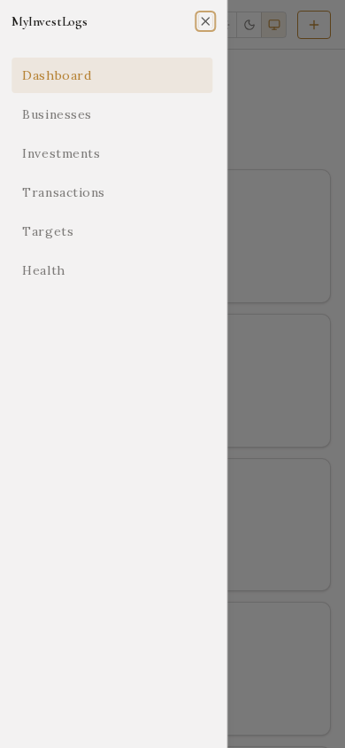

<div align="center">

# MyInvestLogs

**Track investments in small businesses, private ventures and partnerships — the ones no portfolio app supports.**

Self-hosted. Your data stays in a SQLite file on your machine.

[](https://github.com/farhancdr/MyInvestLogs/actions/workflows/ci.yml?query=branch%3Amain)
[](LICENSE)


</div>

> [!IMPORTANT]
> **Use this template and choose Private.** GitHub's dialog defaults to Public, and this app
> **commits its database** — that is how a clone restores your records. A public copy publishes
> every business, amount and date you enter, and git keeps that history even if you delete the
> file later. Run `npm run guard:install` once and a pre-commit hook enforces it for you.


---

## Why

Stock portfolio apps assume public markets, tickers and live prices. None of that exists when you put ৳500,000 into a friend's restaurant for 2% a month, or take a 30% profit share in a trading business.

So people track these in spreadsheets — and spreadsheets get one thing wrong almost every time:

> You invest **৳500,000**. Over a year you receive **৳600,000** back: ৳500,000 of your own capital, plus ৳100,000 of profit.
>
> A spreadsheet says you made ৳600,000. **You made ৳100,000.**

This app is built around that distinction. Capital, principal returned, and profit are separate things, and every number on the dashboard derives from a transaction ledger rather than a hand-maintained total.

## What it does

- **Portfolio dashboard** — capital deployed, received, profit, outstanding, realized ROI
- **Five return models** — fixed annual, monthly fixed, profit share, revenue share, custom
- **Real deal terms** — deal structure (trading partner, mudaraba, partnership, lease), payout cycle, and the security actually held against your money
- **Where to send money** — bank details kept with the business, and editable as they change
- **Honest handling of the awkward cases** — fees, partial payments, defaults and write-offs
- **Expected vs actual** — where an expectation is computable; a clear N/A where it isn't
- **Valuations** — mark what a private stake is worth over time, with unrealized P&L kept separate from realized
- **Allocation targets** — set intended weights, see drift against them, and what to rebalance
- **Health checks** — concentration breaches, overdue maturities, underperformers, and capital that has never been valued
- **Append-only ledger** — corrections are reversing adjustments, enforced by the database
- **Audit log** — every mutation recorded from day one
- **Light, dark or system** — a theme control in the header
- **Works on a phone** — navigation collapses to a drawer, tables scroll inside their own frame

---

## What you need first

Just one thing: **Node.js**. It's a free program that runs the app on your computer.

| | |
|---|---|
| **Node.js 20 or newer** | Required. [Download it here](https://nodejs.org) — take the "LTS" option and click through the installer. |
| **Git** | Required. It's how your records get backed up. [Download](https://git-scm.com/downloads) — on macOS, running `git --version` once will offer to install it. |
| **A GitHub account** | Required, and free. [Sign up](https://github.com/signup). |
| **Docker** | Optional. Only if you'd rather not install Node. See [Running with Docker](#running-with-docker-optional). |

To check what you already have, open **Terminal** (macOS) or **PowerShell** (Windows) and type:

```bash
node -v
```

If it prints something like `v22.11.0`, you're set. If it says "command not found", install Node from the link above and try again.

---

## Get your own copy

**1. Create your private copy**

Click **[Use this template](https://github.com/farhancdr/MyInvestLogs/generate)**, name it whatever you like, and — this part matters — choose **Private**.

> [!WARNING]
> GitHub selects **Public** by default. Change it to **Private**. This app keeps your records inside the repository, so a public copy would publish every business, amount and date you enter.

**2. Download it to your computer**

Copy the two lines below, replacing `<you>` and `<your-repo>` with your GitHub username and the name you chose:

```bash
git clone https://github.com/<you>/<your-repo>.git
cd <your-repo>
```

**3. Install and start it**

```bash
npm install
npm run app
```

The first run takes a minute or two. When you see `Investment Tracker API on http://localhost:3000`, open **http://localhost:3000** in your browser.

**4. Turn on the safety check** (once, recommended)

```bash
npm run guard:install
```

This refuses to save your records if your repository is ever public.

---

## Everyday use

**Starting it up**

```bash
npm run app
```

Then open **http://localhost:3000**. To stop it, press **Ctrl + C** in the terminal.

**Saving your records**

Your data lives in one file, `data/tracker.db`. Committing it is your backup — and it's what lets you pick up on another computer:

```bash
git add data/tracker.db
git commit -m "update records"
git push
```

On a second machine, `git clone` your repository and everything comes back. No export step, no sync service, no account anywhere but GitHub.

> One caveat: commit from one machine at a time. The database is a single file, so two machines editing it separately cannot be merged.

**Trying it out first**

To see a populated dashboard before entering anything real:

```bash
npm run seed         # 11 businesses, 12 investments, 79 transactions
npm run seed:clear   # remove it again
```

The sample set is modelled on real private-investment deals, and deliberately covers every case worth seeing:

- all five return models, and every payout cycle from monthly to per-completed-trade
- deal structures including mudaraba, partnership and lease, each with the security actually held
- an investment that ran its full term and settled cleanly
- one business defaulted **and written off**, and one defaulted with the write-off *not yet recorded* — which is what the critical health check catches
- a short payment, remittance fees, a corrected transaction, and valuations marked both up and down
- two rounds into the same business, which pushes it past the concentration limit

---

## Getting updates

When a new version is released, one command brings it in:

```bash
npm run update
```

Then restart the app:

```bash
npm run app
```

That's all. If the update changes how data is stored, your database is upgraded automatically the next time the app starts — your existing records are migrated, not replaced.

**Your records are never part of an update.** The database is set aside before the update and put back afterwards, so nothing that arrives can overwrite what you have entered.

<details>
<summary>Why not <code>git pull</code>?</summary>

A repository made from a template shares no history with the template, so git has no common ancestor to compare against and refuses a plain `git pull`. `npm run update` handles that, and a few consequences of it:

- The first update needs `--allow-unrelated-histories`; later ones don't.
- Without a common ancestor, git cannot tell "you edited this file" from "you simply have the older version" — so *every* changed file would look like a conflict. The update therefore prefers the incoming version and prints exactly which files it replaced.
- If you have customised the code, your version is still in git history and can be recovered. Keep customisations on their own branch if you want them to survive updates cleanly.
- `data/tracker.db` is excluded from all of the above.

</details>

## Running with Docker (optional)

If you'd rather not install Node, Docker can run everything instead:

```bash
docker compose up --build
```

Same address, **http://localhost:3000**. Your database still lives in `data/tracker.db` in the folder, so backing up works exactly the same way.

```bash
docker compose run --rm tracker npm run seed        # sample data
docker compose run --rm tracker npm run seed:clear  # remove it
```

---

## If something goes wrong

**`command not found: npm`** — Node isn't installed, or the terminal was open before you installed it. Close the terminal, open a new one, try again.

**`Error: listen EADDRINUSE: address already in use :::3000`** — the app is already running in another window, or something else is using port 3000. Either close the other window, or start it on a different port:

```bash
PORT=3001 npm run app
```

**The page won't load** — check the terminal is still running and shows the `Investment Tracker API on…` line. If you pressed Ctrl + C, the app stopped; run `npm run app` again.

**`npm run update` says you have uncommitted changes** — save your work first with `git add -A && git commit -m "my changes"`, then run it again.

**Your repository is public** — run `npm run guard` to check, and make it private in GitHub under **Settings → General → Change visibility**. If you'd rather not keep records in the repository at all, `npm run db:untrack` stops tracking the database and `npm run dump` writes readable snapshots instead.

---

## For developers

```bash
npm run dev        # Vite on :5173, API on :3000, both hot-reloading
npm test           # 62 unit tests — calculation, drift and health rules
npm run test:e2e   # 59 Playwright tests — the real app in a browser
npm run typecheck
```

---

## Screenshots

<table>
<tr>
<td width="50%"><br><em>Investment detail — expected vs actual, terms, full cash-flow timeline</em></td>
<td width="50%"><br><em>Dark mode, following the system setting</em></td>
</tr>
<tr>
<td><br><em>Health — what needs attention, with a next step on every item</em></td>
<td><br><em>Allocation targets and drift, measured on capital outstanding</em></td>
</tr>
<tr>
<td><br><em>Append-only transaction ledger</em></td>
<td><br><em>Adding an investment, with the expected return computed live</em></td>
</tr>
</table>

<p align="center">

&nbsp;&nbsp;

</p>

---

## The accounting rules

These are the decisions that make the numbers trustworthy. Each is enforced in code and covered by tests.

**Every movement of money is a transaction.** Creating an investment writes its opening transaction automatically — initial capital is not a special case. Every total is derived from that ledger, so there is exactly one path to any figure on screen.

**Transactions are append-only.** No update, no delete — enforced by a SQLite trigger, not by convention. A mistake is corrected with a reversing `Adjustment` that points at the original, which stays exactly as recorded. The history stays a record of what was believed at the time.

**A defaulted investment does not write itself off.** Marking a business `Defaulted` changes no number. Capital leaves the outstanding total only when you record an explicit `Loss`, which also reduces realized profit and can push ROI negative. Without this, a dead investment inflates your portfolio forever.

**The payout cycle is separate from the rate.** A deal can accrue 2% a month and hand it over once a quarter. Treating those as one number computes the wrong expectation — so the rate, the term and the payout cycle are three independent fields, and the app tells you what each payout should be worth.

**Expected profit covers the whole term, not one year of it.** A 24-month deal at 15% a year is expected to return 30%. And performance is measured against what has *accrued so far*, not the full-term total, because comparing a six-month-old investment to its two-year expectation reports every young holding as failing.

**Fees reduce profit, never capital.**

**Profit share and revenue share show N/A, never zero.** Their returns depend on business performance and cannot be forecast. Treating unknown as zero would make every profit-share investment look like it infinitely beat expectations.

**Annualized return values open positions at par.** Realized cash flows alone treat un-returned principal as a total loss, so a healthy investment that simply hasn't matured would report a catastrophic IRR. Written-off capital is excluded, so a real default still annualizes to a loss.

**Realized ROI counts recycled capital twice.** Capital invested, returned, then redeployed reads as double the gross deployed. A deliberate, documented choice — which is why the tile is labelled *on total capital deployed* rather than left to be guessed at.

---

## Architecture

```
React 18 + Vite + shadcn/ui   →   Hono API   →   SQLite (better-sqlite3)
```

```
src/
  shared/        types, constants, and calc.ts — every financial rule
  server/
    db/          connection + plain SQL migrations
    services/    ids, audit, dates, validation, repo, metrics
    routes/      HTTP API
  client/
    components/ui/   shadcn components (owned source)
    components/      charts, tables, forms
    pages/           dashboard, businesses, investments, transactions

test/            unit tests for the calculation layer
e2e/             Playwright specs, including screenshot capture
```

**Every financial rule lives in `src/shared/calc.ts` and nowhere else.** It is pure — no database, no framework, no I/O. The server feeds it rows; the client formats what comes back. If a number looks wrong, that one file and its tests are the entire search space.

Metrics are computed on read, never stored. A materialized total can go stale, and a stale financial figure is worse than a slow one: it is wrong without looking wrong.

### Charts

Chart colors are deliberately **not** derived from the UI theme. The eight categorical hues were validated against both light and dark surfaces — lightness band, chroma floor, colorblind separation and normal-vision separation all pass in each mode — and live as their own tokens so a restyle cannot quietly break them.

Cash flow is drawn as polarity (money in above the baseline, out below) rather than as two unrelated series. Allocation is a stacked bar rather than a donut, because shares compare far more easily along a common baseline.

### Testing

The 62 unit tests encode worked examples of each accounting rule, so changing a rule breaks a test by name rather than silently shifting a total. The 59 Playwright tests drive the real app against a seeded database — including that voiding preserves the original row, that future-dated transactions are rejected, and that profit-share investments render N/A rather than a fabricated expectation.

The README screenshots are generated by the same suite, so they cannot drift out of date.

---

## Security

No authentication, by design. The app binds to `127.0.0.1` and is single-user. Do not expose the port beyond your machine.

**Keep your repository private.** `data/tracker.db` is tracked so that cloning restores your records — which means a public repository publishes them. Run `npm run guard:install` once and the pre-commit hook enforces this for you.

The database shipped with this template is empty. It contains the schema and default settings, nothing else.

## License

MIT — see [LICENSE](LICENSE).
