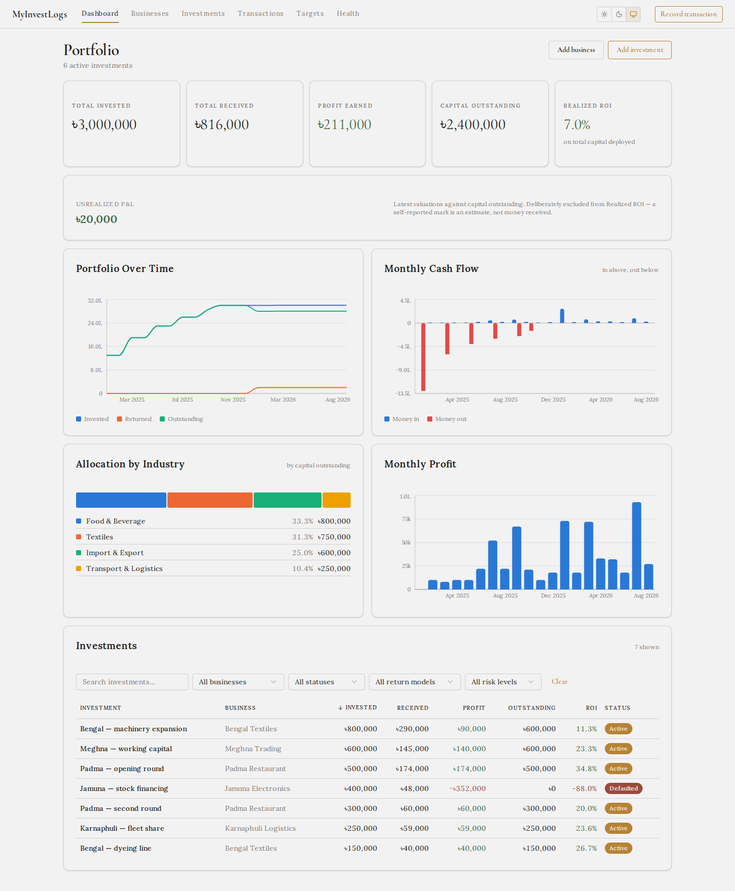
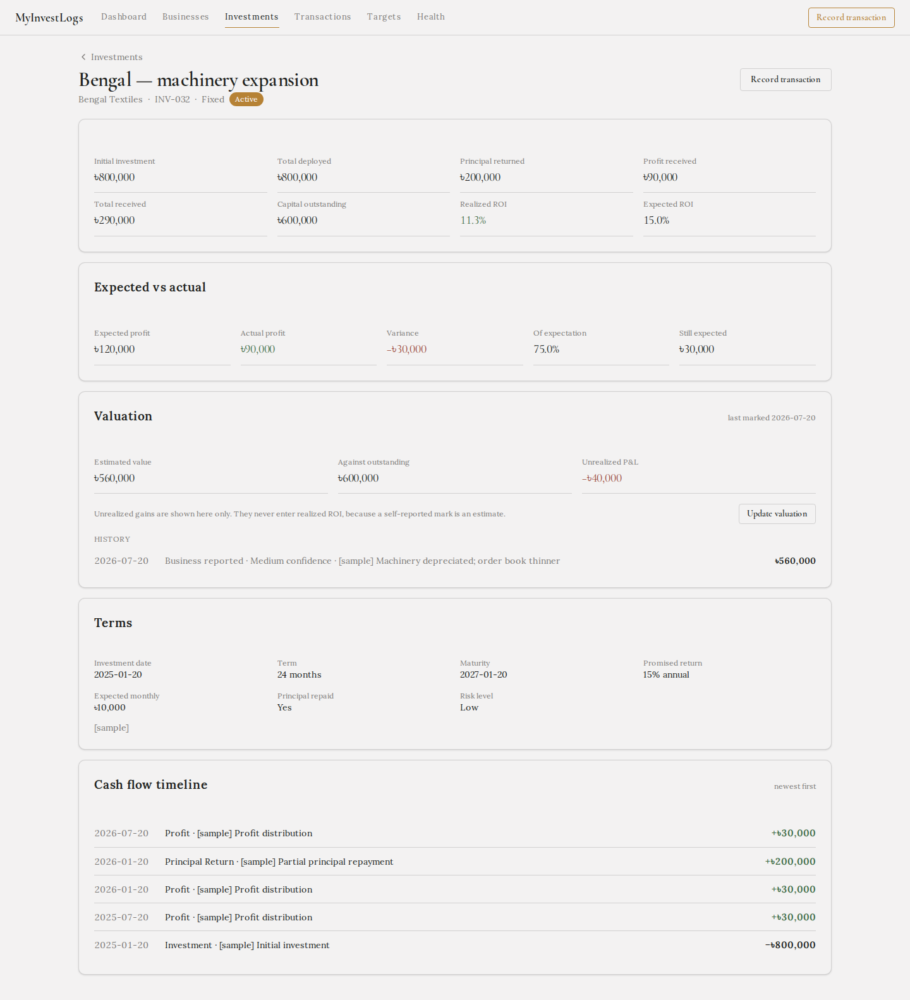
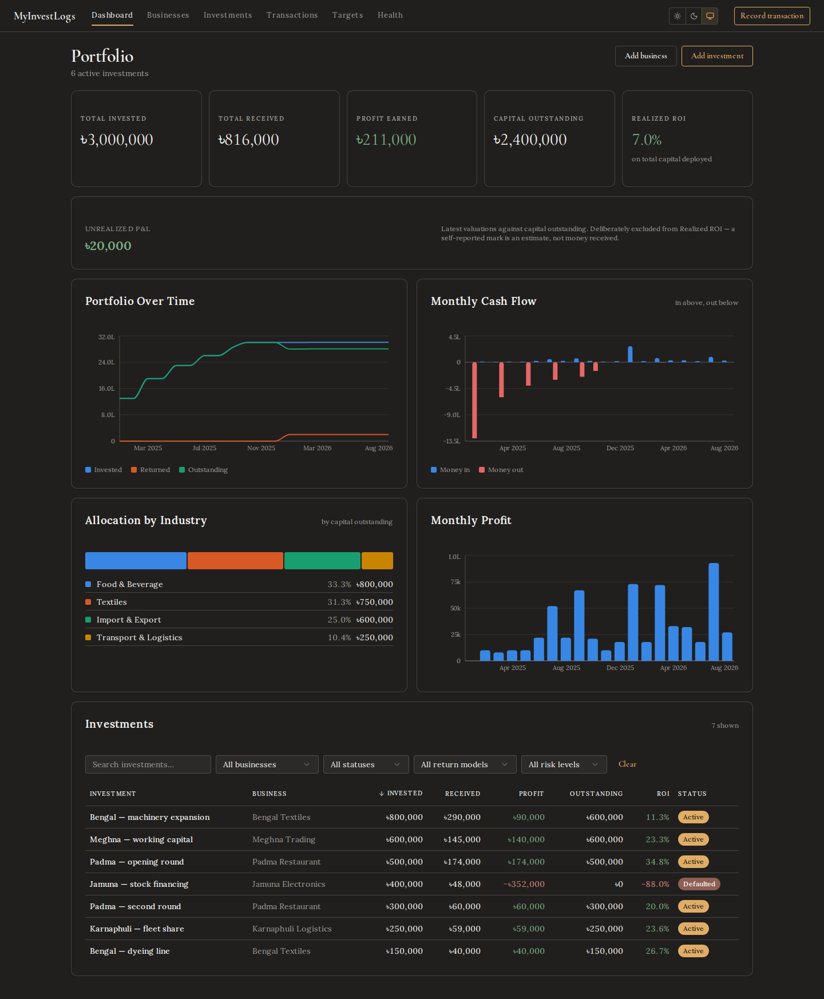
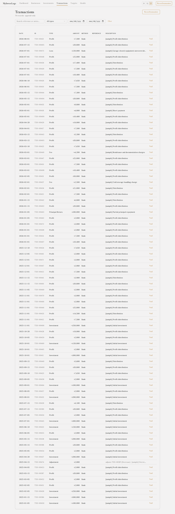
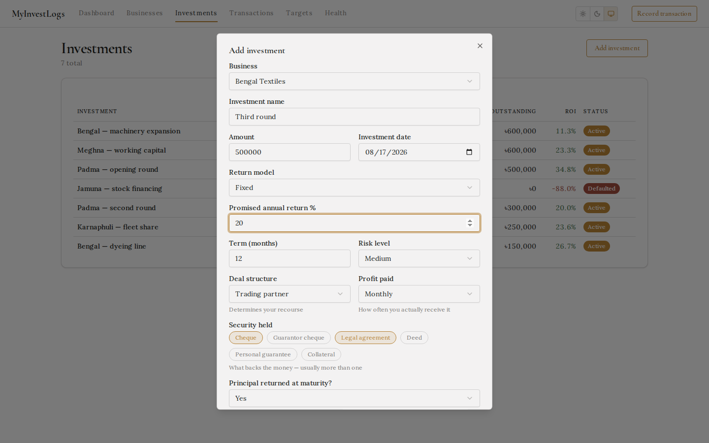

<div align="center">

# Personal Investment Tracker

**Track investments in small businesses, private ventures and partnerships — the ones no portfolio app supports.**

Self-hosted. Your data stays in a SQLite file on your machine.

[](https://github.com/farhancdr/personal-invest-tracker/actions/workflows/ci.yml)
[](LICENSE)


</div>

> [!IMPORTANT]
> **Use this template and choose Private.** GitHub's dialog defaults to Public, and this app
> **commits its database** — that is how a clone restores your records. A public copy publishes
> every business, amount and date you enter, and git keeps that history even if you delete the
> file later. Run `npm run guard:install` once and a pre-commit hook enforces it for you.



---

## Why

Stock portfolio apps assume public markets, tickers and live prices. None of that exists when you put ৳500,000 into a friend's restaurant for 2% a month, or take a 30% profit share in a trading business.

So people track these in spreadsheets — and spreadsheets get one thing wrong almost every time:

> You invest **৳500,000**. Over a year you receive **৳600,000** back: ৳500,000 of your own capital, plus ৳100,000 of profit.
>
> A spreadsheet says you made ৳600,000. **You made ৳100,000.**

This app is built around that distinction. Capital, principal returned, and profit are separate things, and every number on the dashboard derives from a transaction ledger rather than a hand-maintained total.

## What it does

- **Portfolio dashboard** — capital deployed, received, profit, outstanding, realized ROI
- **Five return models** — fixed annual, monthly fixed, profit share, revenue share, custom
- **Honest handling of the awkward cases** — fees, partial payments, defaults and write-offs
- **Expected vs actual** — where an expectation is computable; a clear N/A where it isn't
- **Append-only ledger** — corrections are reversing adjustments, enforced by the database
- **Audit log** — every mutation recorded from day one
- **Light and dark** — following your system setting

---

## Get your own copy

This is a **template repository**. Don't fork it — a fork of a public repo is always public, and this app commits its database.

**[→ Use this template](https://github.com/farhancdr/personal-invest-tracker/generate)** and choose **Private**.

You get a fresh repository with no shared history. Because `data/tracker.db` is tracked, your own commits become your backup: push from your laptop, clone on any other machine, and every record comes with it. No sync service, no export step, no account anywhere.

```bash
git clone https://github.com/<you>/<your-private-repo>.git
cd <your-private-repo>
npm run guard:install      # blocks committing your data to a public repo
docker compose up --build
```

Open **http://localhost:3000**. Record something, then:

```bash
git add data/tracker.db && git commit -m "chore: update records" && git push
```

### The one thing that must stay true

Your repository must be **private**. It holds your complete financial history, and git keeps that history even if you delete the file later.

`npm run guard:install` installs a pre-commit hook that checks your remote's visibility and refuses to commit the database to a public repository. Run `npm run guard` any time to check. If you would rather not track the database at all, `npm run db:untrack` stops tracking it and `npm run dump` writes readable snapshots instead.

## Running it

```bash
docker compose up --build
```

To explore with realistic data before entering anything real:

```bash
docker compose run --rm tracker npm run seed        # 5 businesses, 7 investments, 51 transactions
docker compose run --rm tracker npm run seed:clear  # remove it again
```

The sample set deliberately includes a short payment, a fee, a defaulted business written off, and a corrected transaction — so you can see how the awkward cases actually render.

### Development

```bash
npm install
npm run dev        # Vite on :5173, API on :3000
npm test           # 41 unit tests — the calculation layer
npm run test:e2e   # 26 Playwright tests — the real app in a browser
npm run typecheck
```

---

## Screenshots

<table>
<tr>
<td width="50%"><br><em>Investment detail — expected vs actual, terms, full cash-flow timeline</em></td>
<td width="50%"><br><em>Dark mode, following the system setting</em></td>
</tr>
<tr>
<td><br><em>Append-only transaction ledger</em></td>
<td><br><em>Adding an investment, with the expected return computed live</em></td>
</tr>
</table>

---

## The accounting rules

These are the decisions that make the numbers trustworthy. Each is enforced in code and covered by tests.

**Every movement of money is a transaction.** Creating an investment writes its opening transaction automatically — initial capital is not a special case. Every total is derived from that ledger, so there is exactly one path to any figure on screen.

**Transactions are append-only.** No update, no delete — enforced by a SQLite trigger, not by convention. A mistake is corrected with a reversing `Adjustment` that points at the original, which stays exactly as recorded. The history stays a record of what was believed at the time.

**A defaulted investment does not write itself off.** Marking a business `Defaulted` changes no number. Capital leaves the outstanding total only when you record an explicit `Loss`, which also reduces realized profit and can push ROI negative. Without this, a dead investment inflates your portfolio forever.

**Fees reduce profit, never capital.**

**Profit share and revenue share show N/A, never zero.** Their returns depend on business performance and cannot be forecast. Treating unknown as zero would make every profit-share investment look like it infinitely beat expectations.

**Annualized return values open positions at par.** Realized cash flows alone treat un-returned principal as a total loss, so a healthy investment that simply hasn't matured would report a catastrophic IRR. Written-off capital is excluded, so a real default still annualizes to a loss.

**Realized ROI counts recycled capital twice.** Capital invested, returned, then redeployed reads as double the gross deployed. A deliberate, documented choice — which is why the tile is labelled *on total capital deployed* rather than left to be guessed at.

---

## Architecture

```
React 18 + Vite + shadcn/ui   →   Hono API   →   SQLite (better-sqlite3)
```

```
src/
  shared/        types, constants, and calc.ts — every financial rule
  server/
    db/          connection + plain SQL migrations
    services/    ids, audit, dates, validation, repo, metrics
    routes/      HTTP API
  client/
    components/ui/   shadcn components (owned source)
    components/      charts, tables, forms
    pages/           dashboard, businesses, investments, transactions

test/            unit tests for the calculation layer
e2e/             Playwright specs, including screenshot capture
```

**Every financial rule lives in `src/shared/calc.ts` and nowhere else.** It is pure — no database, no framework, no I/O. The server feeds it rows; the client formats what comes back. If a number looks wrong, that one file and its tests are the entire search space.

Metrics are computed on read, never stored. A materialized total can go stale, and a stale financial figure is worse than a slow one: it is wrong without looking wrong.

### Charts

Chart colors are deliberately **not** derived from the UI theme. The eight categorical hues were validated against both light and dark surfaces — lightness band, chroma floor, colorblind separation and normal-vision separation all pass in each mode — and live as their own tokens so a restyle cannot quietly break them.

Cash flow is drawn as polarity (money in above the baseline, out below) rather than as two unrelated series. Allocation is a stacked bar rather than a donut, because shares compare far more easily along a common baseline.

### Testing

The 41 unit tests encode the PRD's own worked examples, so a rule change breaks a test by name. The 26 Playwright tests drive the real app against a seeded database — including that voiding preserves the original row, that future-dated transactions are rejected, and that profit-share investments render N/A rather than a fabricated expectation.

The README screenshots are generated by the same suite, so they cannot drift out of date.

---

## Roadmap

Phase 1 is complete. Later phases are specified in [`prd.md`](prd.md).

- **Phase 2** — expected payment schedules and matching, annualized ROI on the dashboard, overdue alerts, concentration warnings
- **Phase 3** — scheduled jobs, payment reminders, monthly reports
- **Phase 4** — valuations and unrealized P&L, document links, scenario analysis

The full specification, the review that shaped it, and every resolved design decision are in [`prd.md`](prd.md) and [`prd-review.md`](prd-review.md).

---

## Security

No authentication, by design. The app binds to `127.0.0.1` and is single-user. Do not expose the port beyond your machine.

**Keep your repository private.** `data/tracker.db` is tracked so that cloning restores your records — which means a public repository publishes them. Run `npm run guard:install` once and the pre-commit hook enforces this for you.

The database shipped with this template is empty. It contains the schema and default settings, nothing else.

## License

MIT — see [LICENSE](LICENSE).
